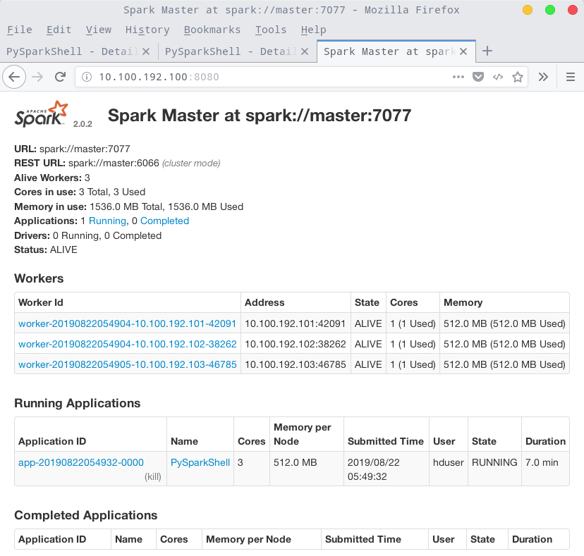
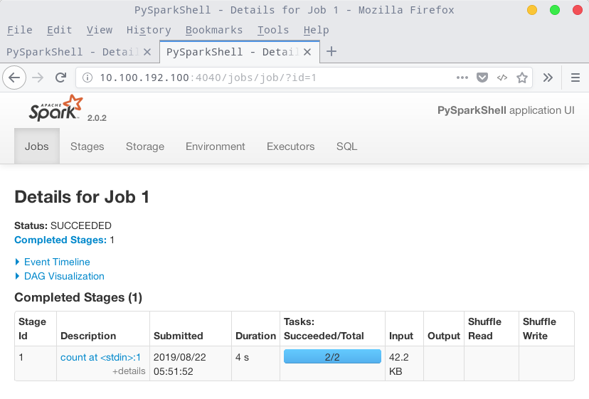
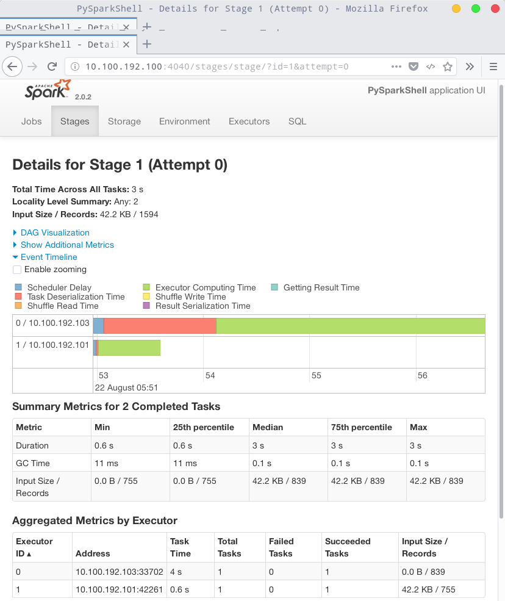

# hadoop-single-node-vagrant

I started this project to be able to set up a simple, working Hadoop environment in minutes and be able recreate the environment without any hassle when I messed up. So I ended up with [Vagrant](http://www.vagrantup.com "Vagrant"):

>Vagrant provides easy to configure, reproducible, and portable work environments built on top of industry-standard technology and controlled by a single consistent workflow to help maximize the productivity and flexibility of you and your team. - [Why Vagrant?](http://docs.vagrantup.com/v2/why-vagrant/index.html "Vagrant Docs: Why Vagrant?")

You can find the code and README at the GitHub repo [hadoop-single-node-vagrant](https://github.com/baswenneker/hadoop-single-node-vagrant).

Setting up the single node hadoop environment is as easy as:

```bash
$ git clone https://github.com/robert0714/hadoop-single-node-vagrant.git
$ vagrant up
```

The first command creates a folder *hadoop-single-node-vagrant* in the current directory and downloads the project files from the git repository. The `vagrant up` command provisions the Hadoop environment. 

During the provisioning process we created a user called *hduser* which we use to execute Hadoop commands. To use the box we have to ssh into it using: 

```bash
$ vagrant ssh master -- -l hduser
```

The password of *hduser* is `hduser`.
You're good to go!

## For learning Hadoop, below are the hardware requirements:

1. Minimum RAM Per a Node required: 4GB (Suggested: 8GB)
1. Minimum Free Disk Space Per a Node: 25GB
1. Minimum Processor i3 or above
1. Operating System of 64bit (Suggested)

## Taking Hadoop for a testdrive
Of course you want to see some action. We'll use the [Hadoop wordcount](http://hadoop.apache.org/docs/r1.2.1/mapred_tutorial.html "Hadoop Wordcount Example Tutorial") example to show off to your friends. 

#### Start HDFS and Yarn
First things first, let's start HDFS and Yarn.

```bash
$ sudo - hduser
$ start-dfs.sh
$ start-yarn.sh
```

To check if all nodes are up and running use `jps` and see if the output is about the same as below:

```bash
$ jps
11261 NameNode
11842 Jps
11365 DataNode
11813 NodeManager
11708 ResourceManager
11542 SecondaryNameNode
```

You can also check the Hadoop ResourceManager Web by browsing to [http://10.100.192.100:8088](http://10.100.192.100:8088) on the host machine.

You can also check the health of Hadoop by browsing to [http://10.100.192.100:50070](http://10.100.192.100:50070) on the host machine.

#### Create the input directory and wordcount file in HDFS
Create the directory that contains the input files of which the words are counted (-p creates the full path). For more information about the HDFS Shell commands, see the [Hadoop File System Shell Guide](http://hadoop.apache.org/docs/current/hadoop-project-dist/hadoop-common/FileSystemShell.html "Hadoop File System Shell Guide")
    
```bash
$ hdfs dfs -mkdir -p /tmp/testing/wordcount_in
```

Create a sample text file that is counted:

```bash    
$ echo "Hello World <> Hello Hadoop" >> sample.txt
```

Copy the sample text to *wordcount_in* folder we just created on the HDFS filesystem.

```bash 
$ hdfs dfs -copyFromLocal sample.txt /tmp/testing/wordcount_in/
```

Just to make sure, check if your file is copied, use:
    
```bash 
$ hdfs dfs -ls /tmp/testing/wordcount_in
Found 1 items
-rw-r--r--  1 hduser  supergroup 38 2014-07-09 09:48 /tmp/testing/wordcount_in/sample.txt
```

#### Run the wordcount example
Now we're ready to let Hadoop take care of counting the words:

```bash 
$ hadoop jar /usr/local/hadoop/share/hadoop/mapreduce/hadoop-mapreduce-examples-*.jar wordcount /tmp/testing/wordcount_in /tmp/testing/wordcount_out
```

You should be able to beat Hadoop by doing the wordcount yourself, but hey you're a geek and Hadoop is awesome, so we use Hadoop. While you're waiting for Hadoop to finish, why not check the cluster status [http://192.168.33.10:8088/cluster](http://192.168.33.10:8088/cluster)?

To check the results afterwards:

```bash 
$ hdfs dfs -ls /tmp/testing/wordcount_out/
Found 2 items
-rw-r--r--  1 hduser supergroup  0 2014-07-09 11:11 /tmp/testing/wordcount_out/_SUCCESS
-rw-r--r--  1 hduser supergroup  84 2014-07-09 11:11 /tmp/testing/wordcount_out/part-r-00000
```

Now let's see if Hadoop came up with the right answer.

```bash 
$ hdfs dfs -cat /tmp/testing/wordcount_out/part-r-00000
    <>      1
    Hadoop  1
    Hello   2
    World   1
```
Wow!

## Some tips
If you messed up the box you can destroy and recreate the box by entering the following commands on the host machine:

    $ vagrant destroy
    $ vagrant up

## Provisioning
In order to save bandwidth and time the provisioning script downloads and store the Hadoop tarball in the shared directory (project folder on the host machine and /vagrant on the guest machine). If the download fails for some reason, delete the tarball and rerun vagrant provision.

## Troubleshooting
You might get the following warning message every now and then:

    WARN util.NativeCodeLoader: Unable to load native-hadoop library for your platform... using builtin-java classes where applicable

This does no harm and can be ignored. For a fix, see http://stackoverflow.com/questions/19943766/hadoop-unable-to-load-native-hadoop-library-for-your-platform-error-on-centos.

## Startup

in master:

```
start-dfs.sh
start-yarn.sh

```
or

```

start-all.sh

```

## Clone a new VM from Master box file

```bash
[hadoop-single-node-vagrant]$ vagrant halt master
[hadoop-single-node-vagrant]$ vagrant package master  --output master.box
[hadoop-single-node-vagrant]$ vagrant box add robert-hadoop-box master.box
```

Now you can create virtual machines from this box by simply giving the name of the box in the Vagrantfile, like

```yaml
config.vm.box = "robert-hadoop-box"
```

## Ansible Usage

```bash

vagrant@master:/vagrant$ ansible-playbook  -k ansible/hadoop-s.yml -i ansible/hosts/hadoop

vagrant@master:/vagrant$ ansible-playbook    ansible/hadoop-m.yml -i ansible/hosts/hadoop

```

## Start DataNode 

```bash
$ hadoop-daemon.sh start namenode

$ hadoop-daemon.sh start datanode
$ yarn-daemon.sh start nodemanager


$ yarn-daemon.sh start resourcemanager

```

##  本機執行pyspark 程式
Step1 進入pyspark

```bash
pyspark --master local[*]
```

Step2. 查看目前的執行模式 

```bash
sc.master
```
Step3 讀取本機檔案

```bash
textFile=sc.textFile("file:/usr/local/spark/README.md")
textFile.count()
```

Step4 讀取HDFS檔案

```bash
textFile=sc.textFile("hdfs://master:9000/user/hduser/wordcount/input/LICENSE.txt")
textFile.count()
```

Step5. 離開pyspark

```bash
exit()
```

## Running Spark on YARN
[reference] (http://pythonsparkhadoop.blogspot.com/2016/09/8-spark-20.html)

Step1 在Hadoop YARN執行pyspark 

```bash
HADOOP_CONF_DIR=/usr/local/hadoop/etc/hadoop  pyspark  --master  yarn  --deploy-mode  client
```

Step2. 查看目前的執行模式 

```bash
sc.master
```

Step3 讀取HDFS檔案

```bash
textFile=sc.textFile("hdfs://master:9000/user/hduser/wordcount/input/LICENSE.txt")
textFile.count()
```

Step4. 在Hadoop Web 介面可以查看PySparkShell App

```bash
http://localhost:8088/
```

離開pyspark

```bash
exit()
```

## Spark standalone cluster
Step1. 啟動Spark standalone cluster 
同時啟動master與salves

```bash
/usr/local/spark/sbin/start-all.sh
```

分別啟動master與salves

```bash
/usr/local/spark/sbin/start-master.sh
/usr/local/spark/sbin/start-slaves.sh
```

Step2. 在Spark Standalone 執行pyspark 

```bash
pyspark --master spark://master:7077 --num-executors 1 --total-executor-cores 3 --executor-memory 512m
```

Step3. 查看目前的執行模式 

```bash
sc.master
```

Step4. 讀取本機檔案

```bash
textFile=sc.textFile("file:/usr/local/spark/README.md")
textFile.count()
```

Step5. 讀取HDFS 檔案

```bash
textFile=sc.textFile("hdfs://master:9000/user/hduser/wordcount/input/LICENSE.txt")
textFile.count()
```

### Spark Web UI Interface
http://10.100.192.100:8080/



### Spark Web UI Interface
http://10.100.192.100:4040/jobs/job/?id=1



### Spark Web UI Interface
http://10.100.192.100:4040/stages/stage/?id=1&attempt=0




## Installation of Anaconda 2.0  

```bash

$ sudo -s
root@master:/~# su - hduser
hduser@data-1:~$ cd /vagrant/
hduser@data-1:/vagrant$ bash Anaconda2-4.3.1-Linux-x86_64.sh  -b

```
## Samples
###  wordCount.java介紹
在下列網址hadoop說明文件中有wordcount.java 的程式碼：

http://hadoop.apache.org/docs/current/hadoop-mapreduce-client/hadoop-mapreduce-client-core/MapReduceTutorial.html

### 編輯wordCount.java
Step1 建立wordcount目錄 

```bash
mkdir -p ~/wordcount/input
cd  ~/wordcount
```

Step2 編輯WordCount.java

```
gedit WordCount.java
```

Step3~6 編輯WordCount.java

在gedit 輸入 WordCount.java完整程式碼

```java
import java.io.IOException;
import java.util.StringTokenizer;

import org.apache.hadoop.conf.Configuration;
import org.apache.hadoop.fs.Path;
import org.apache.hadoop.io.IntWritable;
import org.apache.hadoop.io.Text;
import org.apache.hadoop.mapreduce.Job;
import org.apache.hadoop.mapreduce.Mapper;
import org.apache.hadoop.mapreduce.Reducer;
import org.apache.hadoop.mapreduce.lib.input.FileInputFormat;
import org.apache.hadoop.mapreduce.lib.output.FileOutputFormat;

public class WordCount {

  public static class TokenizerMapper
       extends Mapper{

    private final static IntWritable one = new IntWritable(1);
    private Text word = new Text();

    public void map(Object key, Text value, Context context
                    ) throws IOException, InterruptedException {
      StringTokenizer itr = new StringTokenizer(value.toString());
      while (itr.hasMoreTokens()) {
        word.set(itr.nextToken());
        context.write(word, one);
      }
    }
  }

  public static class IntSumReducer
       extends Reducer {
    private IntWritable result = new IntWritable();

    public void reduce(Text key, Iterable values,
                       Context context
                       ) throws IOException, InterruptedException {
      int sum = 0;
      for (IntWritable val : values) {
        sum += val.get();
      }
      result.set(sum);
      context.write(key, result);
    }
  }

  public static void main(String[] args) throws Exception {
    Configuration conf = new Configuration();
    Job job = Job.getInstance(conf, "word count");
    job.setJarByClass(WordCount.class);
    job.setMapperClass(TokenizerMapper.class);
    job.setCombinerClass(IntSumReducer.class);
    job.setReducerClass(IntSumReducer.class);
    job.setOutputKeyClass(Text.class);
    job.setOutputValueClass(IntWritable.class);
    FileInputFormat.addInputPath(job, new Path(args[0]));
    FileOutputFormat.setOutputPath(job, new Path(args[1]));
    System.exit(job.waitForCompletion(true) ? 0 : 1);
  }
}
```
###  編譯wordCount.java
Step1 修改編譯所需要的環境變數檔

```bash
sudo gedit ~/.bashrc
```

輸入下列內容 

```bash
export PATH=${JAVA_HOME}/bin:${PATH}
export HADOOP_CLASSPATH=${JAVA_HOME}/lib/tools.jar
```

Step2 讓 ~/.bashrc 修改的設定值生效

```bash
source ~/.bashrc
```
Step3 開始編譯 

```bash
hadoop com.sun.tools.javac.Main WordCount.java
jar cf wc.jar WordCount*.class
ll
```

### 建立測試文字檔

```bash
cp /usr/local/hadoop/LICENSE.txt ~/wordcount/input
ll ~/wordcount/input
start-all.sh
hadoop fs -mkdir -p /user/hduser/wordcount/input
cd ~/wordcount/input
hadoop fs -copyFromLocal LICENSE.txt /user/hduser/wordcount/input
hadoop fs -ls /user/hduser/wordcount/input
```

### 執行wordCount.java

```bash
cd ~/wordcount
hadoop jar wc.jar WordCount /user/hduser/wordcount/input/LICENSE.txt /user/hduser/wordcount/output
```

### 查看執行結果

```bash
hadoop fs -ls /user/hduser/wordcount/output
hadoop fs -cat /user/hduser/wordcount/output/part-r-00000
```

# IPython Notebook 

Step1. 建立ipynotebook 工作目錄 

```bash
mkdir -p ~/pythonwork/ipynotebook
cd ~/pythonwork/ipynotebook
```

Step2. 在IPython Notebook 介面執行pyspark 

http://10.100.192.100:8888/tree?

```bash
PYSPARK_DRIVER_PYTHON=ipython PYSPARK_DRIVER_PYTHON_OPTS="notebook" pyspark
```

Step3. 在IPython Notebook 執行程式碼 

```bash
sc.master
```

Step4. 讀取本機檔案程式碼 

```bash
textFile=sc.textFile("file:/usr/local/spark/README.md")
textFile.count()
```

Step5. 輸入讀取HDFS 檔案程式碼 

```bash
textFile=sc.textFile("hdfs://master:9000/user/hduser/wordcount/input/LICENSE.txt")
textFile.count()
```

ch09.ipynb 完整內容請參考本書附錄(APPENDIX A 本書範例程式下載與安裝說明) ，下載本章IPython Notebook 範例檔案。 
http://www.drmaster.com.tw/download/example/MP21622_example.zip


### 使用IPython Notebook在hadoop yarnclient模式執行 

```bash
start-all.sh
cd ~/pythonwork/ipynotebook
PYSPARK_DRIVER_PYTHON=ipython PYSPARK_DRIVER_PYTHON_OPTS="notebook" HADOOP_CONF_DIR=/usr/local/hadoop/etc/hadoop MASTER=yarn-client pyspark
```

Step5. 在Hadoop Web 介面可以查看pyspark App 

```
http://localhost:8088/
```

### 使用IPython Notebook在Spark Stand Alone模式執行
Step1. 啟動Spark Stand Alone cluster 

```bash
/usr/local/spark/sbin/start-all.sh

```
分別啟動master與salves

```bash
/usr/local/spark/sbin/start-master.sh
/usr/local/spark/sbin/start-slaves.sh
```

Step2. 啟動IPython Notebook 在Spark Stand Alone 模式 

```bash
cd ~/pythonwork/ipynotebook
PYSPARK_DRIVER_PYTHON=ipython PYSPARK_DRIVER_PYTHON_OPTS="notebook" MASTER=spark://master:7077 pyspark --num-executors 1 --total-executor-cores 2 --executor-memory 512m
```

Step5. 查看Spark Standalone Web UI 介面 

```
http://master:8080/
```

### 在不同的模式執行IPython Notebook指令整理
####  在Local 啟動IPython Notebook 

```bash
cd ~/pythonwork/ipynotebook
PYSPARK_DRIVER_PYTHON=ipython PYSPARK_DRIVER_PYTHON_OPTS="notebook" pyspark --master local[*]
```

####　在hadoop yarn-client 模式啟動IPython Notebook 

```bash
start-all.sh

PYSPARK_DRIVER_PYTHON=ipython PYSPARK_DRIVER_PYTHON_OPTS="notebook" HADOOP_CONF_DIR=/usr/local/hadoop/etc/hadoop pyspark --master yarn --deploy-mode client
```

####　在Spark Stand Alone 模式啟動IPython Notebook

```bash
start-all.sh

/usr/local/spark/sbin/start-all.sh

PYSPARK_DRIVER_PYTHON=ipython PYSPARK_DRIVER_PYTHON_OPTS="notebook" MASTER=spark://master:7077 pyspark --num-executors 1 --total-executor-cores 3 --executor-memory 512m
```